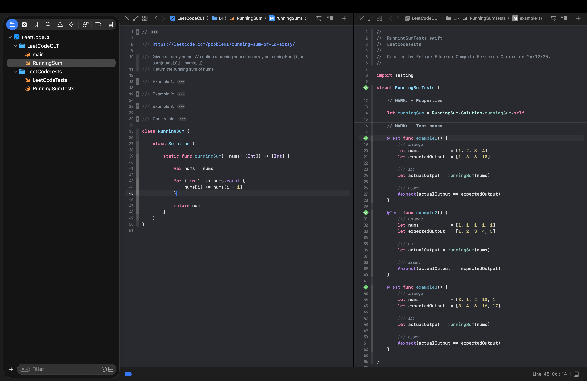

# LeetCode Swift CommandLineTools

Xcode's CLT projects are the fastest way to unit test source code, specially when compared to regular App projects.

## How to continue:
1. _LEFT_: Code structure (source and tests)
2. _MIDDLE_: Source file for a Leetcode problem
3. _RIGHT_: Test file with public cases from Leetcode

